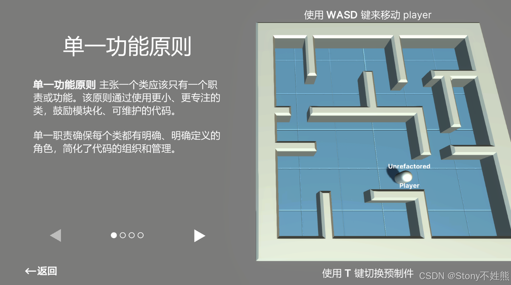
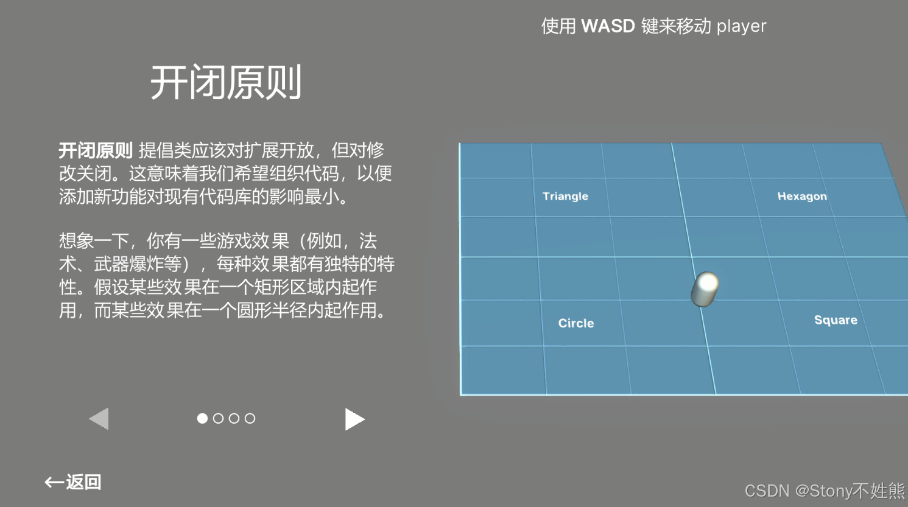
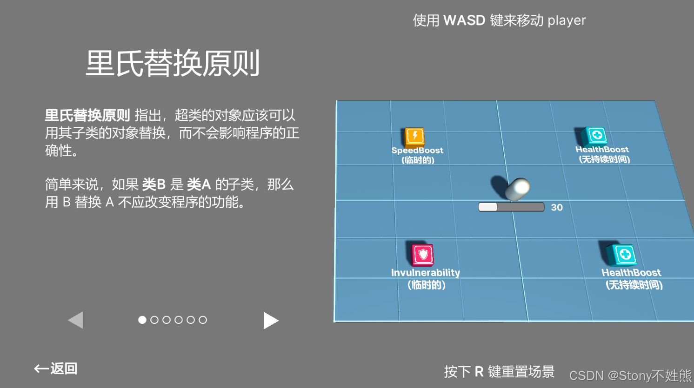
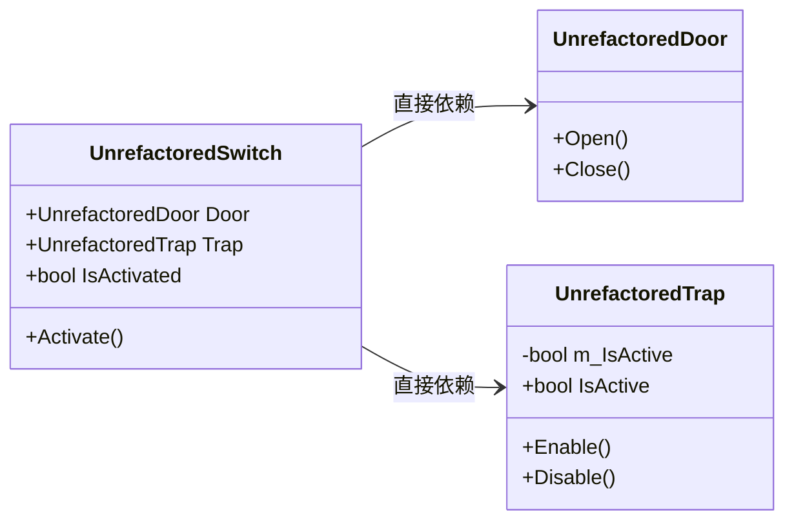
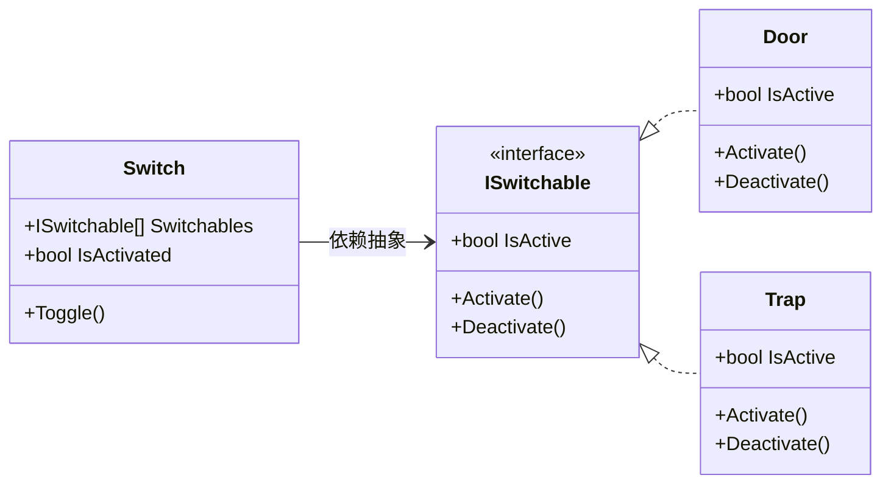

本文结合 Unity 官方电子书《Level up your code with design patterns and SOLID》及其配套示例项目，详细介绍了面向对象设计的五大核心原则——SOLID：单一功能原则（SRP）、开闭原则（OCP）、里氏替换原则（LSP）、接口隔离原则（ISP）和依赖反转原则（DIP）。通过实际的 Unity 代码示例，对比了重构前后的代码差异，分析了每个原则的优缺点和适用场景。此外，还补充介绍了得墨忒耳定律和"少用继承，多用组合"等其他常见设计原则。

<!-- more -->
# 前言
Unity 官方发布的最佳实践指南[《Level up your code with design patterns and SOLID》](https://unity.com/resources/design-patterns-solid-ebook)，我将结合本书配套的示例项目和代码来介绍游戏中一些常见的设计模式，本篇文章是系列的第一篇文章，主要介绍 SOLID 原则。

官方示例项目的下载地址在[这里](https://assetstore.unity.com/packages/essentials/tutorial-projects/level-up-your-code-with-design-patterns-and-solid-289616)。

在撰写文章时同时还参考了李阳阳老师的[《C++设计模式》](https://book.douban.com/subject/37014573/)和蔡升达老师的[《设计模式与游戏完美开发》](https://book.douban.com/subject/26952185/)。

此外，[《Level up your code with design patterns and SOLID》](https://unity.com/resources/design-patterns-solid-ebook)已被翻译为中文，现已上传到 [Github](https://github.com/BearThreeStones/Unity-E-Book-Translate-Project-CN) ，个人翻译。本人水平有限，若有错误还请指正😭，如果可以的话，请帮我点个小星星吧！🥹

# 设计模式
## 什么是设计模式
今天许多软件设计模式源自于 Erich Gamma、Richard Helm、Ralph Johnson 和 John Vlissides 的开创性著作[《设计模式：可复用面向对象软件的基础》](https://book.douban.com/subject/1052241/)（Design Patterns: Elements of Reusable Object-Oriented Software）。这本书描述了在各种日常应用中识别出的23种模式。

原作者通常被称为“四人帮”（Gang of Four，GoF），有些时候这些原始模式也被称为 GoF 模式。

自从“四人帮”于1994年首次出版《设计模式》以来，开发者已经在多个领域发现了更多的面向对象模式。许多工程学科都有成熟的设计模式，游戏开发也不例外。

我们遇到的每一个软件设计问题，都有上千个开发人员曾经遇到过。虽然不能总是直接向他们寻求建议，但是可以通过设计模式从他们的决策中学习。

简单说，设计模式是软件工程中常见问题的通用解决方案，就像一种“答题套路”。它们并非可以直接复制粘贴到代码中的完整解决方案，但是可以为我们提供解决某个特定问题的思路。

通过引入设计模式，让开发者在以后遇到同样的问题时，可以从中找出对应的解决方法直接使用，既减少了时间花费，也保证了软件系统的稳定性、拓展性以及可维护性。

# SOLID 原则
## 什么是 SOLID 原则
SOLID 是一个助忆缩写，代表软件设计的五个核心基本原则。你可以把它们当作在编码时需要牢记的五条基本规则，目的是使面相[对象设计](https://en.wikipedia.org/wiki/Object-oriented)更易于理解、灵活和[可维护](https://en.wikipedia.org/wiki/Software_maintenance) 。

Bob 大叔在其著作《敏捷软件开发: 原则, 模式与实践》介绍了常见的设计原则，也就是 SOLID 原则，它包含5条设计原则：

## 单一功能原则
[单一功能原则](https://en.wikipedia.org/wiki/Single-responsibility_principle) (single responsibility principle, SRP) 也被译做单一责任原则，是第一个也是最重要的 SOLID 原则，单一功能原则说的是一个类应该只有一个改变的理由，那就是它的单一功能。它规定每个模块、类或函数负责一件事，并且只封装那部分逻辑。

换句话说，我们应该创建许多较小的类，而不是一个单体类。因为较短的类和方法更容易解释、理解和实现。

Unity 中的组件（其实也是组件模式的体现）就是很好的例子。当你创建一个游戏对象时，它会包含多个较小的组件。比如：

 - 一个 MeshFilter 组件，用于存储对 3D 模型的引用
 - 一个 Renderer 组件，用于控制模型表面在屏幕上的显示方式
 - 一个 Transform 组件，用于存储缩放、旋转和位置
   一个 Rigidbody 组件，如果它需要与物理模拟互动

每个组件都有其明确的功能，并专注于自己的任务。

就像《代码整洁之道》中所说的：**函数应该做一件事。做好这件事。只做这一件事。**

大家一开始编码时可能不太容易遵守此原则，在项目开发的过程中，往一个类中不断的添加功能，最后让代码变得臃肿，难以维护，也很难知晓该类的主要功能。

所以，在项目开发的过程中要不断的重构代码，将单一类中的不相干的功能抽取出来，封装为其他的类，也就实现了单一功能原则。

### 示例项目


Unity 官方在撰写 SOLID 原则时，都另外撰写了未重构的脚本放在 Unrefactored 文件夹中，用于与应用了 SOLID 原则的脚本进行对比。

在示例项目中，官方使用了两个 player 预制件：

 - 一个叫 UnrefactoredPlayer 挂载 `UnrefactoredPlayer` 脚本，代码如下：


```csharp
namespace DesignPatterns.SRP
{
    /// <summary>
    /// 演示了一个不符合单一功能原则(SRP)的玩家功能实现方式
    /// 
    /// 这个脚本将多个职责（如移动控制、输入处理、音频管理和粒子效果）合并到一个类中
    /// 
    /// 尽管由于其代码量较小，目前还能够管理，但这种方法可能会在扩展、维护和开发时带来困难
    /// </summary>
    public class UnrefactoredPlayer : MonoBehaviour
    {

        [Header("Movement")]
        [Tooltip("Horizontal speed")]
        [SerializeField] private float moveSpeed = 5f;
        [Tooltip("Rate of change for move speed")]
        [SerializeField] private float acceleration = 10f;
        [Tooltip("Deceleration rate when no input is provided")]
        [SerializeField] private float deceleration = 5f;

        [Header("Controls")]
        [Tooltip("Use WASD keys to move")]
        [SerializeField] private KeyCode forwardKey = KeyCode.W;
        [SerializeField] private KeyCode backwardKey = KeyCode.S;
        [SerializeField] private KeyCode leftKey = KeyCode.A;
        [SerializeField] private KeyCode rightKey = KeyCode.D;

        [Header("Collision")]
        [SerializeField] private LayerMask obstacleLayer;

        [Header("Audio")]
        [SerializeField] private AudioClip[] bounceClips;
        [SerializeField] private float audioCooldownTime = 2f;
        private float lastAudioPlayedTime;

        [Header("Effects")]
        [SerializeField] private ParticleSystem m_ParticleSystem;
        private const float effectCooldown = 1f;
        private float timeToNextEffect = -1f;

        private Vector3 inputVector;
        private float currentSpeed = 0f;
        private CharacterController charController;
        private float initialYPosition;
        private AudioSource audioSource;

        private void Awake()
        {
            charController = GetComponent<CharacterController>();
            initialYPosition = transform.position.y;
            audioSource = GetComponent<AudioSource>();
        }

        private void Start()
        {
            lastAudioPlayedTime = -audioCooldownTime;

        }

        private void Update()
        {
            HandleInput();
            Move(inputVector);
        }

        private void HandleInput()
        {
            // 重置输入向量
            float xInput = 0;
            float zInput = 0;

            if (Input.GetKey(forwardKey))
                zInput++;
            if (Input.GetKey(backwardKey))
                zInput--;
            if (Input.GetKey(leftKey))
                xInput--;
            if (Input.GetKey(rightKey))
                xInput++;

            inputVector = new Vector3(xInput, 0, zInput);
        }

        private void Move(Vector3 inputVector)
        {
            if (inputVector == Vector3.zero)
            {
                if (currentSpeed > 0)
                {
                    currentSpeed -= deceleration * Time.deltaTime;
                    currentSpeed = Mathf.Max(currentSpeed, 0);
                }
            }
            else
            {
                currentSpeed = Mathf.Lerp(currentSpeed, moveSpeed, Time.deltaTime * acceleration);
            }

            Vector3 movement = inputVector.normalized * currentSpeed * Time.deltaTime;
            charController.Move(movement);
            transform.position = new Vector3(transform.position.x, initialYPosition, transform.position.z);
        }

        public void PlayRandomAudioClip()
        {
            // 如果播放下一个音频片段的时间已经过去，并且有可用的音频片段，则播放一个随机音频片段
            if (Time.time > (audioCooldownTime + lastAudioPlayedTime))
            {
                lastAudioPlayedTime = Time.time;
                audioSource.clip = bounceClips[Random.Range(0, bounceClips.Length)];
                audioSource.Play();
            }
        }

        public void PlayEffect()
        {
            if (Time.time < timeToNextEffect)
                return;

            if (m_ParticleSystem != null)
            {
                m_ParticleSystem.Stop();
                m_ParticleSystem.Play();
                timeToNextEffect = Time.time + effectCooldown;
            }
        }

        private void OnControllerColliderHit(ControllerColliderHit hit)
        {
            // 检查碰撞的物体的层是否在 obstacleLayer 层遮罩中
            if ((obstacleLayer.value & (1 << hit.gameObject.layer)) > 0)
            {
                PlayRandomAudioClip();
                PlayEffect();
            }

        }

    }
}
```

如代码中所示，`UnrefactoredPlayer` 将多个功能（如移动控制、输入处理、音频管理和粒子效果）合并到一个类中，由于其代码量较小，目前还可以管理，但是这样会在扩展、维护和开发时带来困难。

- 另一个叫 player，其上挂载了5个脚本，分别是：
`Player`，将玩家的不同功能分解为多个专门的组件，初始化时获取其他组件的引用，并且检测碰撞：


```csharp
namespace DesignPatterns.SRP
{
    /// <summary>
    /// 这个类遵循单一功能原则(SRP)。与其使用一个庞大的类，
    /// 该实现将职责划分为多个专门的组件。每个组件专注于玩家行为的特定方面（输入处理、移动、音频和视觉效果）
    /// </summary>
    [RequireComponent(typeof(PlayerInput), typeof(PlayerAudio), typeof(PlayerMovement))]

    public class Player : MonoBehaviour
    {
        [SerializeField]
        [Tooltip("用于识别游戏环境中障碍物的遮罩层")]
        LayerMask m_ObstacleLayer;

        // 处理玩家功能不同方面的组件
        PlayerInput m_PlayerInput;
        PlayerMovement m_PlayerMovement;
        PlayerAudio m_PlayerAudio;
        PlayerFX m_PlayerFX;

        private void Awake()
        {
            Initialize();
        }

        // 设置组件引用
        private void Initialize()
        {
            m_PlayerInput = GetComponent<PlayerInput>();
            m_PlayerMovement = GetComponent<PlayerMovement>();
            m_PlayerAudio = GetComponent<PlayerAudio>();
            m_PlayerFX = GetComponent<PlayerFX>();
        }

        // 当控制器与另一个碰撞体发生碰撞时调用此方法
        private void OnControllerColliderHit(ControllerColliderHit hit)
        {
            // 检查碰撞的对象是否在障碍物层中
            if (m_ObstacleLayer.ContainsLayer(hit.gameObject))
            {
                // 在碰撞时播放一个随机的音频片段
                m_PlayerAudio.PlayRandomClip();

                // 如果定义了视觉效果，则触发
                if (m_PlayerFX != null)
                    m_PlayerFX.PlayEffect();

            }
        }

        private void LateUpdate()
        {
            // 获取来自 PlayerInput 组件的输入向量
            Vector3 inputVector = m_PlayerInput.InputVector;

            // 根据输入向量移动玩家
            m_PlayerMovement.Move(inputVector);
        }
    }
}
```

在 `Player` 类中，组件被作为字段引用（`m_PlayerInput`，`m_PlayerMovement` 等），表明玩家“拥有”这些功能，而不是通过继承将所有功能硬编码到 `Player` 类中。

`PlayerInput`，负责处理玩家的输入：

```csharp
namespace DesignPatterns.SRP
{
    public class PlayerInput : MonoBehaviour
    {
        // 检视面板字段
        [Header("控制")]
        [Tooltip("使用 WASD 键来移动")]
        [SerializeField] private KeyCode m_ForwardKey = KeyCode.W;
        [SerializeField] private KeyCode m_BackwardKey = KeyCode.S;
        [SerializeField] private KeyCode m_LeftKey = KeyCode.A;
        [SerializeField] private KeyCode m_RightKey = KeyCode.D;

        // 私有成员
        private Vector3 m_InputVector;
        private float m_XInput;
        private float m_ZInput;
        private float m_YInput;

        // 属性
        public Vector3 InputVector => m_InputVector;

        // MonoBehaviour 方法
        private void Update()
        {
            HandleInput();
        }

        // 方法
        public void HandleInput()
        {

            // 在每一帧的开始重设输入值为0
            m_XInput = 0;
            m_ZInput = 0;

            if (Input.GetKey(m_ForwardKey))
            {
                m_ZInput++;
            }

            if (Input.GetKey(m_BackwardKey))
            {
                m_ZInput--;
            }

            if (Input.GetKey(m_LeftKey))
            {
                m_XInput--;
            }

            if (Input.GetKey(m_RightKey))
            {
                m_XInput++;
            }

            m_InputVector = new Vector3(m_XInput, m_YInput, m_ZInput);
        }
    }
}
```

`PlayerMovement`，负责处理玩家的移动：

```csharp
namespace DesignPatterns.SRP
{
    public class PlayerMovement : MonoBehaviour
    {
        [Header("移动")] 
        [Tooltip("水平速度")] [SerializeField]
        private float m_MoveSpeed = 5f;

        [Tooltip("移动速度的变化率")] [SerializeField]
        private float m_Acceleration = 10f;

        [Tooltip("当没有输入时的减速率")] [SerializeField]
        private float m_Deceleration = 5f;

        private float m_CurrentSpeed = 0f;
        private CharacterController m_CharController;
        private float m_InitialYPosition;
        private float m_SpeedMultiplier = 1f;

        public CharacterController CharController => m_CharController;

        public float SpeedMultiplier
        {
            get => m_SpeedMultiplier;
            set => m_SpeedMultiplier = value;
        }

        private void Awake()
        {
            m_CharController = GetComponent<CharacterController>();
        }

        void Start()
        {
            m_InitialYPosition = transform.position.y;
        }

        public void Move(Vector3 inputVector)
        {
            if (inputVector == Vector3.zero)
            {
                // 当没有输入时，应用减速
                if (m_CurrentSpeed > 0)
                {
                    m_CurrentSpeed -= m_Deceleration * Time.deltaTime;
                    m_CurrentSpeed = Mathf.Max(m_CurrentSpeed, 0); // 确保速度不会变成负值
                }
            }
            else
            {
                // 当有输入时，平滑过渡到目标速度
                m_CurrentSpeed = Mathf.Lerp(m_CurrentSpeed, m_MoveSpeed, Time.deltaTime * m_Acceleration);
            }

            Vector3 movement = m_CurrentSpeed * m_SpeedMultiplier * Time.deltaTime * inputVector.normalized;
            m_CharController.Move(movement);

            // 强制将 position 的 y 分量保持为常数
            transform.position = new Vector3(transform.position.x, m_InitialYPosition, transform.position.z);
        }
        
    }
}
```

`PlayerAudio`， 负责在玩家与墙壁或障碍物碰撞时播放音效：

```csharp
namespace DesignPatterns.SRP
{
    /// <summary>
    /// 在与墙壁或障碍物碰撞时播放示例音效
    /// </summary>
    public class PlayerAudio : MonoBehaviour
    {
        [SerializeField] 
        float m_CooldownTime = 2f;

        [SerializeField]
        AudioClip[] m_BounceClips;

        float m_LastTimePlayed;
        AudioSource m_AudioSource;

        void Awake()
        {
            m_AudioSource = GetComponent<AudioSource>();
        }

        private void Start()
        {
            m_LastTimePlayed = -m_CooldownTime;
        }

        public void PlayRandomClip()
        {
            // 计算播放下一个音效的时间间隔        
            float timeToNextPlay = m_CooldownTime + m_LastTimePlayed;

            // 检查冷却时间是否已过
            if (Time.time > timeToNextPlay)
            {
                m_LastTimePlayed = Time.time;
                m_AudioSource.clip = GetRandomClip();
                m_AudioSource.Play();
            }
        }

        private AudioClip GetRandomClip()
        {
            // 从数组中随机选择一个音效
            int randomIndex = UnityEngine.Random.Range(0, m_BounceClips.Length);
            return m_BounceClips[randomIndex];
        }
    }
}
```

以及 `PlayerFX`，负责在玩家触发特定事件时播放粒子效果：

```csharp
namespace DesignPatterns.SRP
{
    public class PlayerFX : MonoBehaviour
    {
        [SerializeField]
        ParticleSystem m_ParticleSystem;

        // 粒子系统播放之间的冷却时间
        const float k_Cooldown = 1f;

        float m_TimeToNextPlay = -1f;

        public void PlayEffect()
        {
            // 检查冷却时间是否已过
            if (Time.time < m_TimeToNextPlay)
                return;

            // 如果粒子系统不为空，则播放粒子效果
            if (m_ParticleSystem != null)
            {
                // 在重新播放粒子效果之前停止粒子系统，以避免效果重叠
                m_ParticleSystem.Stop();
                m_ParticleSystem.Play();

                m_TimeToNextPlay = Time.time + k_Cooldown;
            }
        }

    }
}
```

 重构后的代码将原本的 `UnrefactoredPlayer` 类分为 `Player`、`PlayerInput`、`PlayerMovement`、`PlayerAudio` 以及 `PlayerFX` 5 个类，各个类互相不会产生影响，这样的这样的代码有利于开发后期的拓展和维护。

### 优缺点
**优点：**

1. **提高可维护性：** 单一功能的类更容易理解和修改，因为每个类的职责明确，修改时影响较小。
2. **增加可重用性：** 独立的功能可以在其他项目中更容易地重用，不需要重复编写代码。
3. **更好的扩展性：** 当系统功能需要增加时，按功能划分的设计便于新功能的添加，而不会影响现有代码。

**缺点：**

1. **类的数量增加：** 为了遵循单一功能原则，可能会创建大量的小类，这会导致类的数量增加，增加代码管理和组织的复杂度。
2. **可能导致类间通信增加：** 拆分成更多的小类后，可能会导致类之间的交互增多，从而影响系统的性能，特别是在大型系统中。


单一功能原则使代码库更加模块化，易于阅读。它还简化了更新或扩展每个组件的过程，而不会影响其他组件。

## 开闭原则
[开闭原则](https://en.wikipedia.org/wiki/Open%E2%80%93closed_principle) (open-closed principle, OCP) 在 SOLID 设计中表示：类应该对扩展开放，对修改关闭。

为什么要对拓展开放，对修改关闭呢？试想一下，对于一款快要上线或已经上线的游戏，对于其中已经测试完成或已经上线的功能，就不应该再修改这个类的接口或实现内容；如果要增加新的功能，又要保证不修改原有框架，这时候就可以将功能的“操作方法”向上提升并抽象为接口或者基类，将功能的具体实现放到子类中，在子类中实现新增的功能。这样，对于旧的功能就可以保持不变（也就是关闭），同时又能够对功能新增的需求保持开放。

### 示例项目



在示例项目中，玩家可以操控 Player 移动到不同的区域以触发不同的效果和音效，并计算相应形状的面积。

和单一功能原则一样，有一个未重构的脚本叫 `UnrefactoredAreaCalculator`：

```csharp
namespace DesignPatterns.OCP
{ 
public class UnrefactoredAreaCalculator
    {
        // 非SOLID实现：未使用开闭原则。尽管这种方法在少量效果下运行良好，
        // 但随着项目的增长，它无法扩展并变得难以管理。

        public float GetRectangleArea(Rectangle rectangle)
        {
            return rectangle.Width * rectangle.Height;
        }

        public float GetCircleArea(Circle circle)
        {
            return circle.Radius * circle.Radius * Mathf.PI;
        }

        // 添加其他形状的附加方法
        // 例如 GetPentagonArea, GetHexagonArea 等。
    }

    public class Rectangle
    {
        public float Height;
        public float Width;
        
    }

    public class Circle
    {
        public float Radius;
    }
}  
```

它直接为每个形状都准备了一个专门的方法来返回形状的面积，但是如果想添加更多的形状，就要为每个形状添加一个新的方法。如果形状过多，代码就会变得复杂且难以维护。

所以，为了保证程序对扩展开放（能够使用新的形状），而对修改关闭（不修改 `AreaCalculator` 的内部实现）。我们可以单独抽象出一个 `AreaOfEffect` 基类，在其中引入一个名为 `CalculateArea` 的抽象方法。


```csharp
namespace DesignPatterns.OCP
{
    /// <summary>
    /// 播放 ParticleSystem 和 AudioClip。
    /// 
    /// 每个效果区域可以实现其自己的计算区域的独特公式。
    /// 创建一个新的 AreaOfEffect 不会影响现有的，遵循开闭原则。
    /// </summary>
    public abstract class AreaOfEffect : MonoBehaviour
    {
        [Header("粒子效果")]
        [SerializeField]
        [Optional]
        ParticleSystem m_EffectParticleSystem;
        [Header("音频效果")]
        [Optional]
        [SerializeField]
        AudioSource m_EffectAudioSource;
        [Optional]
        [SerializeField]
        AudioClip m_EffectSoundFX;
        [Space]
        [SerializeField] float m_CooldownTime = 1.0f;
        [SerializeField] string m_LabelString;
        [SerializeField] Text m_LabelText;

        /// <summary> 此 AreaOfEffect 的粒子系统。</summary>
        public ParticleSystem EffectParticleSystem => m_EffectParticleSystem;
        /// <summary> 此 AreaOfEffect 的音频源。</summary>
        public AudioSource EffectAudioSource => m_EffectAudioSource;
        /// <summary> 此 AreaOfEffect 的音频剪辑。</summary>
        public AudioClip EffectSoundFX => m_EffectSoundFX;
        public float TotalArea => CalculateArea();
        private float cooldownTimer;

        /// <summary>
        /// 每个 AreaOfEffect 子类实现其自己的 CalculateArea 定义
        /// </summary>
        /// <returns></returns>
        public abstract float CalculateArea();

        /// <summary>
        /// 播放声音和效果。
        /// </summary>
        private void Start()
        {
            if (m_LabelText != null)
                m_LabelText.text = string.Empty;
        }

        public void PlayEffect()
        {
            // 检查冷却时间是否已过。
            if (Time.time >= cooldownTimer)
            {
                cooldownTimer = Time.time + m_CooldownTime;
                PlayParticleEffect();
                PlaySoundEffect();

                ShowAreaText();
            }
        }

        private void PlayParticleEffect()
        {
            if (m_EffectParticleSystem != null)
            {
                m_EffectParticleSystem.Play();
            }
        }

        private void PlaySoundEffect()
        {
            if (m_EffectAudioSource != null && m_EffectSoundFX != null)
            {
                m_EffectAudioSource.PlayOneShot(m_EffectSoundFX);
            }
        }

        public void ShowLabelText(string textToShow)
        {
            if (m_LabelText != null)
            {
                m_LabelText.text = textToShow;
            }
        }

        public void ShowAreaText()
        {
            ShowLabelText(m_LabelString + " " + CalculateArea());
        }
    }
}
```

然后，在派生类中分别实现计算形状面积的公式或播放相应的视觉效果。每个类只需在 `CalculateArea` 中定义自己的逻辑。添加新的区域效果类型不会改变现有代码。

对于圆形的计算，我们有 `CircleEffect` 类：

```csharp
namespace DesignPatterns.OCP
{
    /// <summary>
    /// 显示圆形效果的类。
    /// 
    /// 每个区域效果都可以实现自己的独特公式来计算面积。
    /// 创建一个新的 AreaOfEffect 不会影响现有的，遵循开闭原则。
    /// </summary>
    public class CircleEffect : AreaOfEffect
    {
        [Header("形状")]
        [Tooltip("圆的半径")]
        [SerializeField] float m_Radius;

        public float Radius { get => m_Radius; set => m_Radius = value; }

        public override float CalculateArea()
        {
            return Radius * Radius * Mathf.PI;
        }
    }
}
```


对于六边形的计算，我们有 `HexagonalEffect` 类：

```csharp
namespace DesignPatterns.OCP
{
    /// <summary>
    /// 显示六边形效果的类。
    ///
    /// 每个效果区域可以实现自己的独特公式来计算面积。
    /// 创建一个新的 AreaOfEffect 不会影响现有的，遵循开闭原则。
    /// </summary>
    public class HexagonalEffect : AreaOfEffect
    {
        [Header("形状")]
        [Tooltip("六边形的边长")]
        [SerializeField] private float m_SideLength;

        public override float CalculateArea()
        {
            return (3 * Mathf.Sqrt(3) / 2) * m_SideLength * m_SideLength;
        }
    }
}
```

对于矩形/正方形的计算，我们有 `RectangleEffect` 类：

```csharp
namespace DesignPatterns.OCP
{
    /// <summary>
    /// 显示矩形效果的类。
    /// 
    /// 每个区域效果可以实现其独特的计算面积公式。
    /// 创建一个新的 AreaOfEffect 不会影响现有的，遵循开闭原则。
    /// </summary>
    public class RectangleEffect : AreaOfEffect
    {
        [Header("形状")]
        [Tooltip("矩形的宽度")]
        [SerializeField] private float m_Width;
        [Tooltip("矩形的高度")]
        [SerializeField] private float m_Height;

        public override float CalculateArea()
        {
            return m_Width * m_Height;
        }

    }
}
```

对于三角形的计算，我们有 `TriangularEffect` 类：

```csharp
namespace DesignPatterns.OCP
{
    /// <summary>
    /// 显示等边三角形效果的类。
    ///
    /// 每个效果区域可以实现自己的独特公式来计算面积。
    /// 创建一个新的 AreaOfEffect 不会影响现有的，遵循开闭原则。
    /// </summary>
    public class TriangularEffect : AreaOfEffect
    {
        [Header("形状")]
        [Tooltip("三角形的边长")]
        [SerializeField] private float m_SideLength;

        public override float CalculateArea()
        {
            return (Mathf.Sqrt(3) / 4) * m_SideLength * m_SideLength;
        }
    }
}
```

另外，`EffectTrigger` 检查碰撞，并触发相应的效果：

```csharp
namespace DesignPatterns.OCP
{
    public class EffectTrigger : MonoBehaviour
    {
        [Tooltip("与此组件碰撞时触发的效果区域")]
        [SerializeField] AreaOfEffect m_Effect;
        [Tooltip("触发之间的最小时间间隔（秒）")]
        [SerializeField] float m_Cooldown = 2f;

        float m_LastEffectTime = -1;
        // player 的标签
        const string k_PlayerTag = "Player";

        private void OnTriggerEnter(Collider other)
        {
            PlayEffect(other);

            if (other.CompareTag(k_PlayerTag) && m_Effect != null)
                m_Effect.ShowAreaText();
        }

        private void OnTriggerStay(Collider other)
        {
            if (other.CompareTag(k_PlayerTag))
                PlayEffect(other);
        }

        private void OnTriggerExit(Collider other)
        {
            if (other.CompareTag(k_PlayerTag) && m_Effect != null)
                m_Effect.ShowLabelText(string.Empty);
        }

        private void PlayEffect(Collider other)
        {
            float nextEffectTime = m_LastEffectTime + m_Cooldown;

            // 检查标签
            if (other.CompareTag(k_PlayerTag) && Time.time > nextEffectTime)
            {
                m_LastEffectTime = Time.time;

                // 为玩家触发效果
                m_Effect.PlayEffect();
            }
        }
    }
}
```

### 优缺点
**优点：**

1. **提高系统的扩展性：** 遵循开闭原则的代码更容易适应变化或新增功能，能够保持原有代码的通用性和向后兼容性，可以通过添加新模块来扩展功能，而不需要修改现有代码。

2. **支持多态和灵活的设计：** 开闭原则通常依赖于**抽象**和**接口**，这种设计模式可以让程序更灵活地响应变化。

3. **保留整体框架：** 程序中原有的类设计不会变动，整体框架保留，不做无用功。


**缺点：**

1. **增加代码复杂度：** 扩展功能时需要创建新的模块、继承类或实现接口，这可能导致项目中的类和模块数量增多，代码的层次结构更加复杂。

2. **可能降低性能：** 过多的抽象和接口调用，可能会带来一定的性能开销，尤其是在实时系统或高性能场景中。

## 里氏替换原则
[里氏替换原则](https://en.wikipedia.org/wiki/Liskov_substitution_principle)(Liskov substitution principle, LSP) 派生类必须能够替代其基类使用，也就是“子类必须能够替换父类”。父类中一定包含了可以由子类重新实现的方法，而客户端的操作接口也是由父类来实现的。客户端在使用时，不必也不需要知道目前使用的对象是由哪一个子类实现的。至于哪个子类的对象来替代父类的对象，则是由类本身的对象产生机制来决定。

### 示例项目


示例项目中通过一组 Buff 道具展示了里氏替换原则。

本示例文件中的脚本还是比较多的，我们还是重点来看实现增益的脚本，其他的包括生命值、无敌、场景重载以及粒子效果的脚本都不是重点内容，就不放上来了。

还是先来看未重构的脚本，在 Unrefactored 文件中共有两个脚本，分别是：

`UnrefactoredPowerUp`，其他 `PowerUP` 的基类：

```csharp
namespace DesignPatterns.LSP
{
    /// <summary>
    /// 其他PowerUp的基类。
    /// </summary>
    [RequireComponent(typeof(Collider))]
    public abstract class UnrefactoredPowerUp : MonoBehaviour
    {
        const string k_PlayerTag = "Player";

        // 在每个子类中重写逻辑
        public abstract void ApplyEffect(GameObject player);

        // 所有PowerUp的通用功能可以添加在这里
        protected void OnTriggerEnter(Collider other)
        {
            if (!other.gameObject.CompareTag(k_PlayerTag))
                return;

            // 应用子类的逻辑
            ApplyEffect(other.gameObject);

            // 处理PowerUp的收集或销毁
            CollectPowerUp();
        }

        // 移除/消耗PowerUp
        protected void CollectPowerUp()
        {
            // 在这里处理PowerUp的收集或销毁
            Destroy(gameObject);
        }
    }
}
```

乍一看好像没什么问题啊，为什么需要重构呢？我们先来看看子类。

`UnrefactoredSpeedBoost`，实现加速，这里 Unity 只举了加速增益的例子： 

```csharp
namespace DesignPatterns.LSP
{
    /// <summary>
    /// 这个类违反了里氏替换原则。子类添加了基类中不存在的基于时间的持续时间。
    /// 尽管逻辑是功能性的，但“持续时间”不是基类的概念。
    /// 因此，UnrefactoredSpeedBoost 不能替代其他不支持持续时间的 PowerUp。
    /// </summary>
    public class UnrefactoredSpeedBoost : UnrefactoredPowerUp
    {
        public float m_SpeedMultiplier = 2f;
        public float m_Duration = 5f; // 基类不支持持续时间

        public override void ApplyEffect(GameObject player)
        {
            if (m_Duration > 0)
            {
                SpeedModifier playerMovement = player.GetComponent<SpeedModifier>();
                if (playerMovement != null)
                {
                    playerMovement.ModifySpeed(m_SpeedMultiplier, m_Duration);
                }
            }
            else
            {
                // 对于只期望“ApplyEffect”而没有持续时间的人来说，这个分支或逻辑可能会令人困惑。
                // 如果使用这个逻辑，并不是每个PowerUp都是可以互换的。
            }
        }
    }
}
```

发现问题所在了吗？由于子类中增加了新的变量，导致了一个问题：

代码的上下文中，基类的用户可能并不期望 `PowerUp` 具有持续时间的特性。说白了就是在我们使用基类时根本不知道有 buff 持续时间这回事。 

再来看看重构后的类是如何解决问题的：

重构后的 `PowerUp`，添加了一个新的表示持续时间的变量：

```csharp
namespace DesignPatterns.LSP
{
    /// <summary>
    /// 其他PowerUp的基类。
    /// </summary>
    [RequireComponent(typeof(Collider))]
    public abstract class PowerUp : MonoBehaviour
    {
        [Tooltip("PowerUp持续时间，如果是临时的")]
        [SerializeField] protected float m_Duration;

        protected const string k_PlayerTag = "Player";

        // 在每个子类中重写逻辑
        public abstract void ApplyEffect(GameObject player);

        // 可以在此处添加所有PowerUp的通用功能
        protected void OnTriggerEnter(Collider other)
        {
            if (!other.gameObject.CompareTag(k_PlayerTag))
                return;

            // 播放随机的哔声
            PlaySound(other.gameObject);

            // 应用子类的逻辑
            ApplyEffect(other.gameObject);

            // 处理PowerUp的收集或销毁
            CollectPowerUp();
        }

        protected void PlaySound(GameObject player)
        {
            PlayerAudio m_PlayerAudio = player.GetComponent<PlayerAudio>();

            if (m_PlayerAudio != null)
            {
                m_PlayerAudio.PlayRandomClip();
            }
        }
        // 移除/消耗PowerUp
        protected void CollectPowerUp()
        {
            // 在此处处理PowerUp的收集或销毁
            Destroy(gameObject);
        }
    }
}
```

这样我们就知道增益是有持续时间的，至于用还是不用，就看具体的子类是如何实现的就行了。

 重构后的 `SpeedBoost`：

```csharp
namespace DesignPatterns.LSP
{

    /// <summary>
    /// 每个PowerUp子类都可以有自己独特的行为。
    /// </summary>
    public class SpeedBoost : PowerUp
    {
        [Header("速度参数")]
        [Tooltip("用于乘以速度的因子")]
        [SerializeField]
        float m_SpeedMultiplier = 2f;

        // 在子类中重写此方法
        public override void ApplyEffect(GameObject player)
        {
            // 在此处添加SpeedBoost逻辑
            SpeedModifier speedModifier = player.GetComponent<SpeedModifier>();

            if (speedModifier != null)
            {
                speedModifier.ModifySpeed(m_SpeedMultiplier, m_Duration);
            }
        }
    }
}
```

现在，直接调用父类的持续时间变量就行了，不需要再单独声明一个新的变量。

当然，除了修改基类以外，也有其他的方法。以下是《Level Up Your Code With Design Patterns And SOLID》中提到的如何更好的遵循里氏替换原则：


> - **如果在子类化时移除功能，可能会破坏里氏替换原则：** `NotImplementedException` 是违反此原则的明显标志，方法留空也会导致这种情况。如果子类没有像基类那样的行为，您就没有遵循 LSP —— 即使没有显式的错误或异常。
> - **保持抽象简洁：** 您在基类中添加的逻辑越多，越有可能破坏 LSP。基类应该只表达派生子类的共同行为。 
> - **子类需要与基类具有相同的公共成员：** 这些成员在调用时也需要具有相同的签名和行为。 在建立类层次结构之前，考虑类的 API： 现实中的分类不一定能直接转化为类的继承关系。
> - **倾向于组合而非继承：** 与其通过继承传递功能，不如创建一个接口或单独的类来封装某种特定行为。然后通过组合不同的功能来构建“组合”。

### 优缺点
**优点：**

1. **增强代码的可维护性：** 遵循里氏替换原则的代码，父类和子类可以互换使用，不会破坏程序逻辑。这使得代码结构清晰且易于维护。

2. **提高代码的复用性：** 通过抽象父类和接口，子类可以重用父类的逻辑，避免重复代码。

3. **降低耦合性：** 遵循里氏替换原则的设计，依赖于抽象而非具体实现，能够减少模块之间的耦合，增加代码的灵活性。


**缺点：**

1. **可能导致不必要的复杂性：** 为了符合 LSP，有时需要将一个简单的继承关系重构为更复杂的接口组合，这增加了类的数量和结构的复杂性。

2. **需要更精细的抽象设计：** 为了遵守 LSP，开发者往往需要倾向于**组合优于继承**，这要求在设计初期就对类和接口的 API 进行更深思熟虑的规划，而不是简单地通过继承来复用代码。

## 接口隔离原则
[接口隔离原则](https://en.wikipedia.org/wiki/Interface_segregation_principle)(interface segregation principle, ISP)指出，“客户端不应该被迫使用它们用不到的接口方法”。这个问题会随着项目的开发而变得越来越明显。当项目中出现了一个负责主要功能的类，而且这个类还必须负责跟其他子系统进行沟通时，针对每一个子系统的需求， 主要类就必须增加对应的方法。但是，增加越多的方法就等同于增加类的接口复杂度。因此， 每当要使用这个类的方法时，就要小心地从中选择正确的方法，无形之中增加了开发和维护的困难度。

简单来说，我们要避免使用庞大的接口，这一点与单一功能原则的思想类似。通过使接口保持紧凑和专注来提供最大的灵活性。
### 示例项目


示例项目展示了通过一组目标对象来应用接口隔离原则。

还是先来看未重构的脚本，`UnrefactoredTarget`：

```csharp
namespace DesignPatterns.ISP
{
    public interface ITarget
    {
        void TakeDamage(int amount);
        void Explode();
        void TriggerEffect();
    }
    
    /// <summary>
    /// 这个类实现了 ITarget 接口，其中包括承受伤害、爆炸和触发效果的方法。
    /// 即使一个简单的目标可能只需要承受伤害，它也被迫实现 ITarget 接口中定义的所有方法。这导致了空方法的实现。
    /// </summary>
    public class UnrefactoredTarget : MonoBehaviour, ITarget
    {
        // 即使这个目标只需要承受伤害，它也必须实现所有方法。
        public void TakeDamage(int amount)
        {
            // 实现伤害逻辑。
        }

        public void Explode()
        {
            // 即使这个目标不需要爆炸，这个方法也必须实现。
        }

        public void TriggerEffect()
        {
            // 同样地，即使不需要，这也需要一个实现。
        }
    }
}
```

这就是所说的接口过于庞大，职责不统一了，`ITarger` 接口将“承受伤害”、“爆炸”和“触发效果”这三种行为统一定义在一个接口中，客户端被迫实现了不需要的方法（`Explode`、`TriggerEffect`），即使根本没有使用这些功能。

来看看如何应用接口隔离原则来解决此问题，以下是重构后的代码：

首先，将 `ITarget` 接口拆分，分别为：

`IDamageable`，实现承受伤害的接口：

```csharp
namespace DesignPatterns.ISP
{
    /// <summary>
    /// 定义了收到伤害的契约。
    /// </summary>
    public interface IDamageable
    {
        void TakeDamage(float amount);
    }
}
```

`IEffectTrigger`，实现触发效果的接口：

```csharp
namespace DesignPatterns.ISP
{
    /// <summary>
    /// 定义了在特定位置触发效果（如粒子系统或声音效果）的契约。
    /// </summary>
    public interface IEffectTrigger
    {
        void TriggerEffect(Vector3 position);
    }
}
```

以及 `IExplodable`，实现爆炸效果的接口：

```csharp
namespace DesignPatterns.ISP
{
    /// <summary>
    /// 定义了可爆炸对象的契约。
    /// </summary>
    public interface IExplodable
    {
        // 触发爆炸（例如粒子或其他游戏对象效果）
        void Explode();
    }
}
```

接着，我们可以将 `UnrefactoredTarget` 也一并拆分，让他们分别实现相应的接口：

`Target`，目标的基类，包含生命和伤害，实现 `IDamageable` 接口：

```csharp
namespace DesignPatterns.LSP
{
    /// <summary>
    /// 游戏中目标的基类，包含生命和伤害。
    /// </summary>
    public class Target : Health, IDamageable
    {
        [Tooltip("自定义此目标的伤害倍率")]
        [SerializeField] float m_DamageMultiplier = 1f;
        public override void TakeDamage(float amount)
        {

            base.TakeDamage(amount * m_DamageMultiplier);

            // 在此处自定义任何额外的类特定逻辑
            // Debug.Log($"Target custom TakeDamage: {amount}");
        }
    }
}
```

`HitEffect`，实现 `IEffectTrigger` 接口：

```csharp
namespace DesignPatterns.ISP
{
    /// <summary>
    /// 实现了一个投射物击中表面时触发的效果。接口隔离原则提倡更小的、特定于客户端的接口。
    /// </summary>
    public class HitEffect : MonoBehaviour, IEffectTrigger
    {
        [SerializeField] private ParticleSystem m_ParticleSystem;

        public void TriggerEffect(Vector3 position)
        {
            // 如果粒子系统不为空，则播放粒子系统效果。
            if (m_ParticleSystem != null)
            {
                m_ParticleSystem.transform.position = position;
                // 在再次播放粒子系统之前停止它，以避免效果重叠。
                m_ParticleSystem.Stop();
                m_ParticleSystem.Play();
            }
        }
    }
}
```

以及 `ExplodableTarget`，实现 `IExplodable` 接口：

```csharp
namespace DesignPatterns.ISP
{
    /// <summary>
    /// 可以爆炸并在死亡时实例化效果的目标类型。这里继承自基础目标类并添加了IExplodable接口
    /// </summary>
    public class ExplodableTarget : Target, IExplodable
    {
        [Tooltip("爆炸时实例化的效果")]
        [SerializeField] GameObject m_ExplosionPrefab;

        protected override void Die()
        {
            base.Die();
            Explode();
        }

        public void Explode()
        {
            if (m_ExplosionPrefab)
            {
                GameObject instance = Instantiate(m_ExplosionPrefab, transform.position, quaternion.identity);
            }

            // 在这里添加自定义爆炸逻辑
        }
    }
}
```

接口的隔离使得对象在游戏环境中的交互更加灵活。比如，对于 `Projectile` 类，也就是子弹类，可以影响其他对象，而它自己并不需要知道每个目标的具体实现，只需要在运行时进行检查和类型转换，再调用相应的方法就行了，就像下面这样：

```csharp
private void OnCollisionEnter(Collision collision)
{
    CheckCollisionInterfaces(collision);
    DeactivateProjectile();
}

private void DeactivateProjectile()
{
    m_Rigidbody.linearVelocity = Vector3.zero;
    m_Rigidbody.angularVelocity = Vector3.zero;

    m_ObjectPool.Release(this);
}

private void CheckCollisionInterfaces(Collision collision)
{
    // 获取第一个接触点
    ContactPoint contactPoint = collision.GetContact(0);

    // 轻微偏移以将其移出表面
    float pushDistance = 0.1f;
    Vector3 offsetPosition = contactPoint.point + contactPoint.normal * pushDistance;

    var monoBehaviours = collision.gameObject.GetComponents<MonoBehaviour>();
    foreach (var monoBehaviour in monoBehaviours)
    {
        HandleDamageableInterface(monoBehaviour);
        HandleEffectTriggerInterface(monoBehaviour, offsetPosition);
    }
}

private void HandleDamageableInterface(MonoBehaviour monoBehaviour)
{
    if (monoBehaviour is IDamageable damageable)
    {
        damageable.TakeDamage(m_DamageValue);
    }
}

private void HandleEffectTriggerInterface(MonoBehaviour monoBehaviour, Vector3 position)
{
    if (monoBehaviour is IEffectTrigger effectTrigger)
    {
        effectTrigger.TriggerEffect(position);
    }
}
```

### 优缺点

**优点：**

1. **减少依赖，降低耦合：** 客户端只依赖它需要的接口，这减少了模块之间的耦合，使得系统的模块更独立，而且修改某个接口的方法不会影响与之无关的实现类。

2. **避免“空实现”的问题：** 一个大而臃肿的接口会让实现类必须实现所有方法，即使有些方法是无关的。这会导致空实现的代码，增加冗余和维护成本。

3. **符合单一职责原则：** 接口隔离原则将接口设计得更加专一，符合 SRP（单一职责原则），避免了接口中包含过多职责。

**缺点：**

1. **接口数量增加：** 由于将一个大接口拆分成多个小接口，会导致接口的数量增多，增加了项目文件和代码管理的复杂性。

2. **增加接口间的关系处理：** 多个小接口可能会有交集或者相互依赖的情况，需要额外设计来协调这些接口的关系。另外，当某些类需要组合多个接口时，会让类的实现变得复杂。

## 依赖反转原则
[依赖反转原则](https://en.wikipedia.org/wiki/Dependency_inversion_principle) (dependency inversion principle, DIP) 指出，高层模块不应直接依赖于低层模块。两者都应该依赖于抽象；抽象不应该依赖细节，细节应依赖于抽象。

这很容易让人感到困惑。高层和低层指的是什么？这些模块内容是什么？有哪些抽象？

像 Unity 这样的游戏引擎为用户提供了一个位于游戏代码不同层的 API。游戏引擎实际上存在于另一个模块（程序集）中，该模块被封装并与游戏代码库隔离开来。在Unity 中，游戏引擎是一个高层模块，而用户实现的 MonoBehaviour 则存在于低层模块中。高层模块总是比低层模块更抽象，也就是说更通用。

依赖反转所陈述的是我们已经通过经验知道的。游戏引擎框架来自于我们的游戏程序集所依赖的不同程序集，它无法直接知道我们在应用程序代码库中声明的类。这意味着抽象模块（Unity 框架）不依赖于细节（我们实现的 MonoBehaviour 类）。它们都依赖于 Monobehaviour 接口。由于两层都必须知道接口，因此接口必须由高层模块提供（并且在技术上不能有其他方式）。

依赖反转原则进一步推动了我们。这不仅仅是游戏引擎和游戏代码库的问题。依赖反转希望我们在实现中找到共同的行为，抽象它们并将它们打包到更高级别的模块中。

依赖反转原则可以帮助减少类之间的紧密耦合。在构建应用程序中的类和系统时，一些类自然是“高层次”的，一些则是“低层次”的。高层类依赖于低层类来完成某些任务，而 SOLID 原则告诉我们要反过来。依赖不再是来自低层模块的实现，而是由高层模块本身拥有和提供的抽象。

什么是依赖呢？ 依赖则是指**一个类或项目对外部类、库或框架的依赖关系**。 简单的说，当一个类使用了另一个类或库提供的功能时，就形成了依赖，它就有一个依赖。依赖反转原则强调不要将这种依赖关系放错了位置。

每个依赖都会带来一定的风险。如果一个类知道另一个类的内部实现方式太多，修改第一个类可能会破坏第二个类，反之亦然。高度耦合被认为是不良的编码实践。应用程序中的一个错误可能会引发一连串的问题。对于软件系统的设计，最好情况是实现[松耦合](https://en.wikipedia.org/wiki/Loose_coupling)和[高内聚](https://en.wikipedia.org/wiki/Cohesion_%28computer_science%29)。

理想情况下，目标是尽量减少类之间的依赖。每个类的内部部分也需要紧密协作，而不是依赖外部连接。当一个对象依赖于内部或私有逻辑进行工作时，它被认为是内聚（cohesive）的。
### 示例项目


示例项目展示了通过实现一个门和陷阱的例子来应用依赖反转原则。点击每个开关来激活相应的设备。记住，高层模块（例如开关）不应依赖低层模块（例如门或陷阱）。

来看未重构的代码：

- 先是开关，`UnrefactoredSwitch`

```csharp
namespace DesignPatterns.DIP
{
    /// <summary>
    /// 表示未重构形式的开关机制，直接控制门或陷阱。
    /// 它直接依赖于具体类（UnrefactoredDoor，UnrefactoredTrap），这使得它
    /// 缺乏灵活性并且与它控制的机制的具体实现紧密耦合。
    /// </summary>
    public class UnrefactoredSwitch : MonoBehaviour
    {

        public UnrefactoredTrap Trap;
        public UnrefactoredDoor Door;
        public bool IsActivated;

        public void Activate()
        {
            if (IsActivated)
            {
                IsActivated = false;
                Door.Close();
                Trap.Disable();
            }
            else
            {
                IsActivated = true;
                Door.Open();
                Trap.Enable();
            }
        }

    }
}
```

 - 然后是门，`UnrefactoredDoor`：
 
```csharp
namespace DesignPatterns.DIP
{

    public class UnrefactoredDoor : MonoBehaviour
    {
        public void Open()
        {
            Debug.Log("门已打开。");
        }

        public void Close()
        {
            Debug.Log("门已关闭。");
        }
    }
}
```

最后是陷阱，`UnrefactoredTrap`：

```csharp
namespace DesignPatterns.DIP
{
    public class UnrefactoredTrap : MonoBehaviour
    {
        private bool m_IsActive;
        public bool IsActive => m_IsActive;

        public void Enable()
        {
            m_IsActive = true;
            Debug.Log("The trap is active.");
        }

        public void Disable()
        {
            m_IsActive = false;
            Debug.Log("The trap is inactive.");
        }
    }
}
```

在 `UnrefactoredSwitch` 中，直接 public 了 `Door` 和 `Trap` 组件，在编辑器中直接拖拽引用，这样开关、门和陷阱代码就紧密耦合在一起了。如果我们不止想激活门和陷阱呢，如果我们需要激活一盏灯该怎么办呢？这样的代码缺乏灵活性。

如何解决这个问题呢？只要插入一个接口就行了，如下：

`ISwitchable` 接口，抽象出激活和停用对象的细节：

```csharp
namespace DesignPatterns.DIP
{
    /// <summary>
    /// 定义可切换对象的契约。此接口通过抽象激活和停用对象的细节，有助于实现依赖反转原则。
    /// </summary>
    public interface ISwitchable
    {
        public bool IsActive { get; }

        public void Activate();
        public void Deactivate();
    }
}
```

这样，我们只要在 `Switch` 中添加 `ISwitchable` 接口，让 `Switch` 类变成依赖于 `ISwitchable` 的客户端，而不是直接依赖于 `Door` 或 `Trap`。

来看重构后的代码：

- Switch：

```csharp
namespace DesignPatterns.DIP
{
    /// <summary>
    /// 一个开关组件，可以切换ISwitchable客户端的状态。此类通过依赖抽象（ISwitchable）而不是具体实现来演示依赖反转原则。
    /// </summary>
    public class Switch : MonoBehaviour
    {
        // Unity的序列化系统不直接支持接口。通过使用实现ISwitchable的MonoBehaviour的序列化引用来解决此限制。

        [SerializeField] private MonoBehaviour m_ClientBehaviour;
        private ISwitchable m_Client => m_ClientBehaviour as ISwitchable;


        // 切换关联的ISwitchable客户端的活动状态。
        public void Toggle()
        {
            if (m_Client == null)
                return;

            if (m_Client.IsActive)
            {
                m_Client.Deactivate();
            }
            else
            {
                m_Client.Activate();
            }
        }
    }
}
```

- Door：

```csharp
namespace DesignPatterns.DIP
{

    /// <summary>
    /// 一个门组件，可以打开和关闭两扇滑动门。此类通过抽象接口 ISwitchable 进行控制，展示了依赖反转原则 (DIP)。
    /// 这使得门与触发它的开关解耦。
    /// </summary>
    public class Door : MonoBehaviour, ISwitchable
    {
        [Tooltip("左侧滑动门")]
        [SerializeField] private Transform m_LeftDoor;
        [Tooltip("右侧滑动门")]
        [SerializeField] private Transform m_RightDoor;
        [Tooltip("左侧门打开时的偏移位置")]
        [SerializeField] private Vector3 m_LeftDoorOffset;
        [Tooltip("右侧门打开时的偏移位置")]
        [SerializeField] private Vector3 m_RightDoorOffset;
        [Tooltip("门的开关速度")]
        [SerializeField] private float m_Speed = 5f;

        // 缓存门的位置
        private Vector3 m_LeftDoorStartPosition;
        private Vector3 m_RightDoorStartPosition;
        private Vector3 m_LeftDoorEndPosition;
        private Vector3 m_RightDoorEndPosition;

        // 跟踪门当前是否处于打开状态。
        private bool m_IsActive;
        public bool IsActive => m_IsActive;


        private void Start()
        {
            // 假设门的变换从关闭位置开始
            m_LeftDoorStartPosition = m_LeftDoor.position;
            m_RightDoorStartPosition = m_RightDoor.position;
            m_LeftDoorEndPosition = m_LeftDoorStartPosition + m_LeftDoorOffset;
            m_RightDoorEndPosition = m_RightDoorStartPosition + m_RightDoorOffset;
        }

        // 打开门，将它们移动到指定的打开位置。
        public void Activate()
        {
            m_IsActive = true;
            Debug.Log("门已打开。");
            StartCoroutine(SlideDoor(m_LeftDoor, m_LeftDoorEndPosition, m_Speed));
            StartCoroutine(SlideDoor(m_RightDoor, m_RightDoorEndPosition, m_Speed));
        }

        // 关闭门，将它们移回到起始位置。
        public void Deactivate()
        {
            m_IsActive = false;
            Debug.Log("门已关闭。");
            StartCoroutine(SlideDoor(m_LeftDoor, m_LeftDoorStartPosition, m_Speed));
            StartCoroutine(SlideDoor(m_RightDoor, m_RightDoorStartPosition, m_Speed));
        }

        // 插值单个门朝向特定位置
        private IEnumerator SlideDoor(Transform door, Vector3 targetPosition, float speed)
        {
            while (door.position != targetPosition)
            {
                door.position = Vector3.MoveTowards(door.position, targetPosition, speed * Time.deltaTime);
                yield return null;
            }
        }
    }

}
```

- Trap：

```csharp
namespace DesignPatterns.DIP
{
    /// <summary>
    /// Trap 类表示基于物理的陷阱门，实现了 ISwitchable 接口。
    /// </summary>
    public class Trap : MonoBehaviour, ISwitchable
    {
        // 用于物理交互的刚体组件。
        private Rigidbody m_Rigidbody;

        // 陷阱的原始位置，用于重置其位置。
        private Vector3 m_OriginalPosition;

        // 陷阱的原始旋转，用于重置其旋转。
        private Quaternion m_OriginalRotation;

        // ISwitchable 的激活状态
        private bool m_IsActive;
        public bool IsActive => m_IsActive;

        private void Start()
        {
            // 缓存物理组件
            m_Rigidbody = GetComponent<Rigidbody>();

            // 禁用基于物理的移动，但允许碰撞检测和手动移动
            m_Rigidbody.isKinematic = true;

            // 缓存原始的变换值
            m_OriginalPosition = transform.position;
            m_OriginalRotation = transform.rotation;
        }

        // 启用物理并标记为激活状态。
        public void Activate()
        {
            m_IsActive = true;
            Debug.Log("陷阱已激活。");

            m_Rigidbody.isKinematic = false;
        }

        // 停用陷阱并标记为非激活状态。
        public void Deactivate()
        {
            // 重置刚体为 kinematic 以禁用基于物理的移动。
            m_Rigidbody.isKinematic = true;
            m_IsActive = false;

            // 重置陷阱的位置和旋转到原始值。
            transform.position = m_OriginalPosition;
            transform.rotation = m_OriginalRotation;

            Debug.Log("陷阱已重置。");
        }
    }
}
```

 这里的门和陷阱添加了具体实现，我们只要知道他们实现了 `ISwitchable`  接口。

这样修改后，如果我们想实现开关激活其他物体就变得很容易了，只要让其实现 `ISwitchable` 接口就行了，增加了代码的灵活性，方便拓展。

看代码可能有点不方便，直接看类图吧：

未重构版本：



重构版本：


这样一看就很直观了，未重构版本中 `UnrefactoredSwitch` 直接依赖于 `UnrefactoredDoor` 和 `UnrefactoredTrap`，而重构后的版本中，`Door` 和 `Trap` 依赖于 `ISwitchable` 接口，`Switch` 依赖于 `ISwitchable` 接口，反转了依赖关系。

### 优缺点

**优点：**
1. **降低耦合性，提高代码的可维护性：** 高层模块（业务逻辑）与低层模块（具体实现）解耦，只依赖于抽象，减少修改某个具体实现时影响其他模块的风险。

2. **支持依赖注入（Dependency Injection, DI）：** 依赖抽象可以让我们更容易使用依赖注入框架，进一步提升代码的灵活性和可测试性。


**缺点：**
1. **增加代码复杂度：** 需要引入接口或抽象类，使代码结构变得更复杂，特别是在小型项目或简单需求下，可能会显得过度设计。

2. **可能导致过多的抽象：** 如果不合理使用，可能会产生大量接口，但其中许多接口的实现只有一个具体类，导致**无意义的抽象（Needless Abstraction）**，增加代码冗余。


# 总结：对 SOLID 的理解
到这里，让我们回顾总结一下 SOLID 原则。

 - **单一功能原则：** 确保每个类只做一件事，且只有一个变更原因。 
 - **开闭原则：** 您应该能够在不改变现有代码的情况下扩展一个类的功能。
 - **里氏替换原则：** 子类应该能够替换基类。 
 - **接口隔离原则：** 保持接口简短，方法尽量少，客户端只实现它们需要的功能。 
 - **依赖反转原则：** 依赖于抽象，不要直接依赖具体类。

分析一下 SOLID 原则的优缺点，看了上面的优缺点分析，你会发现 SOLID 原则的优点和缺点可以概括为：

**优点：**

1. **提升代码质量：** 增强可读性、可维护性和可测试性。

2. **支持复杂系统：** 通过解耦和抽象，适应需求变化和功能扩展。

3. **降低耦合度：** 模块间依赖清晰，减少“牵一发而动全身”的风险。

**缺点：**

 1. **设计成本高：** 初期需要更多时间设计抽象和接口。
    
 2. **过度工程风险：** 简单场景可能因追求原则而复杂化。
    
 3. **灵活性受限：** 某些原则（如 LSP）可能限制实现自由。

使用 SOLID 可以帮助我们编写更简洁的代码，旨在提高代码的可维护性和可扩展性。但是，有得必有舍，在某些情况下，遵循 SOLID 原则可能需要在开始时进行额外的工作；我们可能需要将某些功能重构成抽象或接口；过多的接口和类可能还会导致代码冗余。

但这是值得的，长远来看，这种做法能带来更大的回报。

当然，它们不是绝对的。我们应该自行决定在项目中严格遵循这些原则的程度。一定要记住：理解原则背后的思考比具体的语法更重要。保持简单，不要为了应用这些原则而强行将它们加入脚本中。让它们在必要时自然地融入到代码中。

# 其他常见的设计原则
这里就是我结合《C++ 设计模式》和《设计模式与游戏完美开发》的补充了，没有相关的示例项目，就带大家快速过一下吧。

## 得墨忒耳定律
[得墨忒耳定律](https://en.wikipedia.org/wiki/Law_of_Demeter)（Law of Demeter，LoD）有时被翻译为迪米特法则，又称为最少知识原则（Least Knowledge Principle，LKP），即类的设计对外暴露的越少越好，用最少的知识说明了类的设计。通俗的说就是不要和陌生人说话，只与直接依赖的组件通信。得墨忒耳定律封装方法调用，限制访问路径，避免链式调用。

来举个例子吧，有一个小餐厅，顾客（Customer）在餐厅下单（Order），每个订单可能包含多个菜品（MenuItem），顾客在结账时需要计算订单总价。

### 示例
来看未重构的代码：

- 菜品类，`MenuItem`：

```csharp
// 菜品类
public class MenuItem
{
    public string Name { get; set; }
    public decimal Price { get; set; }
}
```

 - 订单类，`Order`：

```csharp
// 订单类
public class Order
{
    private List<MenuItem> _items = new List<MenuItem>();
    
    public void AddItem(MenuItem item)
    {
        _items.Add(item);
    }
    
    // 暴露订单内部的菜品列表（违反得墨忒耳定律！）
    public List<MenuItem> GetItems()
    {
        return _items;
    }
}
```

 - 顾客类，`Customer`：

```csharp
// 顾客类
public class Customer
{
    public void Checkout(Order order)
    {
        // 直接访问订单内部的菜品列表，并计算总价（危险！）
        decimal total = 0;
        foreach (var item in order.GetItems()) // 顾客依赖了MenuItem的细节
        {
            total += item.Price;
        }
        Console.WriteLine($"Total price: {total}");
    }
}
```

可以看到，`Customer` 不仅依赖于 `Order`，还依赖了 `MenuItem` 中的变量，形成了链式调用。如果后序 `Order` 内部的数据结构变化，所有的 `GetItems()` 代码都要修改。

来看应用了得墨忒耳定律的代码是怎么做的：

菜品类保持不变：

```csharp
// 菜品类（不变）
public class MenuItem
{
    public string Name { get; set; }
    public decimal Price { get; set; }
}
```

在订单类中封装了计算逻辑：

```csharp
// 订单类（封装计算逻辑）
public class Order
{
    private List<MenuItem> _items = new List<MenuItem>();
    
    public void AddItem(MenuItem item)
    {
        _items.Add(item);
    }
    
    // 提供计算总价的方法，隐藏内部细节
    public decimal CalculateTotal()
    {
        return _items.Sum(item => item.Price);
    }
}
```

顾客类直接调用订单的方法：

```csharp
// 顾客类（只与直接朋友交互）
public class Customer
{
    public void Checkout(Order order)
    {
        // 直接调用订单的CalculateTotal方法，无需知道内部细节
        decimal total = order.CalculateTotal();
        Console.WriteLine($"Total price: {total}");
    }
}
```

 `Order` 封装了计算总价的逻辑，只对外暴露 `CalculateTotal()` 方法。`Customer` 直接与朋友 `Order` 交互，不再依赖 `MenuItem`。

想象你去餐厅吃饭：

- **违反得墨忒耳定律：** 你（Customer）直接冲进厨房，查看每道菜（MenuItem）的价格，自己算总价。

- **遵守得墨忒耳定律：** 你告诉服务员（Order）“我要结账”，服务员帮你算好总价后告诉你结果。

后者更符合现实逻辑——你不需要了解厨房的细节，只需与服务员交互。

## 少用继承，多用组合
在最开始的单一功能原则中，我们注意到 Player 类没有通过继承（而且 C# 也不支持多继承）来实现复杂的行为，而是通过组合方式，将不同的职责分散到多个专门的组件中（例如 PlayerInput、PlayerMovement、PlayerAudio 和 PlayerFX）。这其实就是少用继承，多用组合的体现。

当子类继承一个接口或父类时，必须实现其中定义的所有方法，这可能导致子类暴露出一些对客户端而言不必要的功能（如时钟类中提供当前时间的功能，但闹钟客户端只关心设定时间）。在这种情况下，采用组合方式，即在闹钟类中声明一个时钟类成员，并通过该成员提供所需的功能，就能减少冗余方法和降低依赖。特别是在不支持多重继承的语言（如 C#）中，使用组合比继承更灵活、易于维护，并更好地实现封装，使客户端只关注必要的功能。

再比如在[《游戏编程模式》](https://book.douban.com/subject/26880704/)中提到的类型对象模式也是这一原则的体现。“少用继承，多用组合”的理念正是类型对象模式的核心思想之一：通过组合不同的组件来构建对象，而不是通过继承来获得所有功能。

在游戏编程中，类型对象模式通常用于避免深层次的继承层级，将游戏实体的特性和行为通过组合来定义。比如，一个游戏角色或物体可能具有多种属性（如生命值、速度、攻击力等）和行为，如果使用继承，很可能会陷入复杂且难以扩展的继承体系。类型对象模式则将这些属性和行为分解成独立的组件，通过组合将它们赋予不同的对象，从而实现灵活的扩展和重用。

当然，还是那句话，原则不是绝对的，不一定要刻意去遵守，而且继承改写成组合意味着要做更细颗粒度的类拆分。这也意味着，我们要定义更多的类和接口。

### 如何判断该用组合还是继承
尽管我们鼓励多用组合少用继承，但组合也并不是完美的，继承也并非一无是处。实际的项目开发中，我们还是要根据具体的情况，来具体选择用继承还是组合。

**继承适用情况：**

 - 当类之间的继承关系稳定，不易改变时，可以使用继承。
   
 - 如果继承层次较浅（例如最多两层），且继承关系简单、清晰，那么继承是一个合适的选择。
   
 - 某些设计模式（例如模板模式）本身就是基于继承实现的，此时使用继承更符合设计意图。

**组合适用情况：**

- 当系统需求经常变化，或类之间的关系较为复杂、继承层次较深时，使用组合可以降低耦合，使得系统更易于扩展和维护。

- 组合能够让对象通过聚合或委托其他对象的方式获得所需功能，而不必受限于固定的继承层次，适合灵活变化的场景。

- 例如装饰者模式、策略模式和组合模式等，都强调通过组合来动态地扩展对象功能。

# 更新
## 2025年11月29日
更新了依赖反转原则的描述
# 引用
## 书籍
蔡升达.(2016). [《设计模式与游戏完美开发》](https://book.douban.com/subject/26952185/).清华大学出版社

李阳阳.(2024).[《C++设计模式》](https://book.douban.com/subject/37014573/).人民邮电出版社

Robert Nystrom.(2016).[《游戏编程模式》](https://book.douban.com/subject/26880704/).人民邮电出版社

Unity.(2023).[《Level up your code with design patterns and SOLID》](https://unity.com/resources/level-up-your-code-with-game-programming-patterns?isGated=false). Unity E-Book

## 文章
舍是境界.(2021).[设计模式：为什么说要多用组合少用继承？如何决定该用组合还是继承？](https://www.jianshu.com/p/c7cd5c49302f). 简书
[Seba's Lab](http://www.sebaslab.com/).(2015).[The truth behind Inversion of Control – Part IV – Dependency Inversion Principle](http://www.sebaslab.com/the-truth-behind-inversion-of-control-part-iv-dependency-inversion-principle/)
